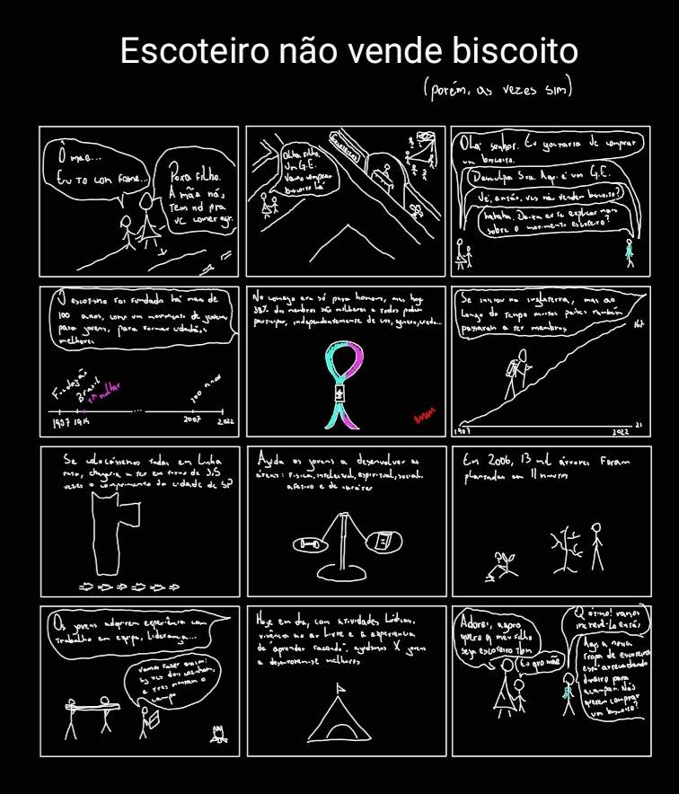
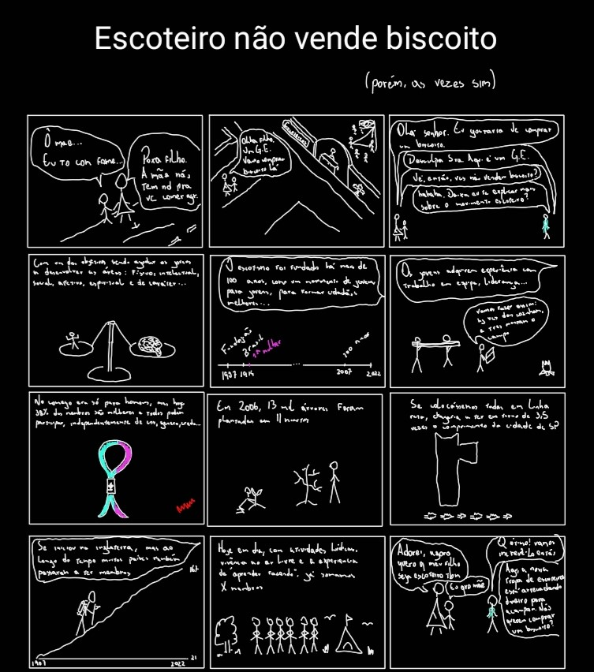

# Visualização da Informação

  

## Escola de Matemática Aplicada - Fundação Getúlio vargas

## Mestrado em Modelagem Matemática

  

**Aluno:** Bruno Pereira Fornaro.

**Github do projeto:** https://github.com/BrunoFornaro/datacomic_escotismo

  

# Data Comic - Escotismo

# Briefing

  

## Introdução

Este trabalho tem como objetivo produzir um Data Comic que explique sobre o que se trata o Movimento Escoteiro e qual seu impacto para a sociedade, baseando-se em dados.

A ideia surge da necessidade de transmitir às pessoal em geral o que o escoteiro faz e para que serve o escotismo além do que é mostrado nos filmes, pois neles, no geral, é retratada uma realidade muito distorcida, que não representa o que de fato é o Movimento Escoteiro.

  

## Escolha da base de dados

Para a escolha dos dados que serão utilizados no trabalho e serão relevantes para o resultado final obtido advém de uma extensa pesquisa em dados sobre o escotismo, nos quais em sua maioria não estão bem estruturados e muitas vezes incompletos.

  

Como esses dados são muitos esparsos, só iremos destacar a seguir alguns dados e informações consideradas relevantes para o resultado final:

  

* Inclusão e representatividade: em 2020, 38% dos membros da União dos Escoteiros do Brasil eram mulheres;

* Impacto social: em 2006, os escoteiros, na cidade de São Paulo, plantaram 13 mil árvores em 11 minutos (quebrando um recorde mundial);

* Dimensão do movimento escoteiro: começou na Inglaterra, mas se espalhou pelo mundo ao longo dos anos e hoje está presente em 170 países (os dados do ano de chegada do Movimento Escoteiro podem ser encontrados, de forma que é possível ver o crescimento dessa quantidade acumulada de países com escoteiros), e

* Marcos importantes:

  * O Movimento Escoteiro foi fundado em 1907;

  * A chegada no Brasil aconteceu em 1910;

  * A primeira mulher no Movimento Escoteiro ingressou em 1916, e

  * O movimento completa 100 anos em 2007.

  

Devemos ressaltar que a coleta desses dados foi feita em fontes distintas e que no meio desse processo encontrou-se uma dificuldade quanto à completude e estruturação dos dados. Por exemplo, em certos casos, se encontrava a quantidade absoluta de membros mulheres no Brasil, mas não ficava claro o ano do levantamento dos dados, e também não sendo informada a quantidade total de membros, para que fosse verificada a proporção.

  

As fontes para esses dados e demais dados pesquisados se encontram na bibliografia deste briefing.

  

## Inspirações

Como o trabalho tem o objetivo de produzir quadrinhos com o tema do escotismo, foi procurado se já existe algum trabalho que já foi feito ou ainda é feito nesse sentido. Dessa forma, foram encontrados os quadrinhos do escotista Beto Basso e Altamiro Vilhena, no projeto [Balaio Quadrado](https://www.instagram.com/balaioquadrado/), que tratam do tema do escotismo.

  

No geral, esses quadrinhos trazem o tema com características e conhecimentos do "nicho", de forma que em alguns casos pode ficar complicado para um leitor que não é escoteiro compreender. O objetivo é focar naqueles que conseguem se comunicar com todos os públicos, independentemente do conhecimento prévio, pois anseia-se que o resultado final desse projeto possa comunicar para o maior número de pessoas possível a mensagem que se deseja transmitir.

  

Além disso, também se tem como inspiração um dos livros feitos pelo fundador do escotismo, Baden-Powell, chamado [Escotismo para rapazes](https://www.escoteiros.org.br/literaturas/Gerais/Escotismo_para_rapazes.pdf), no qual trás ilustrações com traços que lembram os de quadrinhos, pela forma simplificada, com certa riqueza de destalhes mas, ao mesmo tempo, de uma forma minimalista. Com isso, podemos ver que esse tipo de traço também é algo já natural e inserido no contexto do tema escolhido, não fazendo com que o trabalho se distancie da forma que o tema já foi tratado anteriormente, podendo ser mais facilmente desenvolvido e bem aceito.

  

Com isso, pretende-se criar quadrinhos com uma linguagem de fácil acesso, e com um desenho minimalista, apenas com riqueza de detalhes suficiente para transmitir a mensagem desejada (até mesmo pelo nível de habilidade de desenho que seria necessário para produzir algo mais detalhado).

  

## Esboço

Tendo em mente a pretensão do projeto, os dados pesquisados e as referências bem estudadas, podemos com isso criar esboços iniciais do resultado desejado, com um desenho muito simples apenas para representar a ideia, para que a ideia não seja perdida ou esquecida e também para ter uma noção de como irá ficar a disposição dos recursos visuais nos quadros, num contexto geral.

  

Dessa forma, foi produzido um primeiro esboço, com falas muito simples para registrar a ideia central de cada quadro e com uma linguagem simplificada para agilizar esse processo criativo. Segue abaixo o primeiro esboço:

  

  

Com isso, foi possível reunir a ideia para todos os quadros, assim como a contextualização do _story telling_ e a finalização da história com um "alívio cômico", para deixar a história mais leve e atrativa. Entretanto, a disposição do conteúdo de desenvolvimento e apresentação dos dados e da mensagem pretendida ainda se encontra meio confusa, não se conectando bem as histórias dos quadros, de um para o outro, e também as visualizações principais ficaram muito aglomeradas, sendo desejado distribuí-las mesmo, de forma mais espaçadas, nos quadros. Assim, segue um segundo esboço:

  

  

## Bibliografia

  

BASSO, Beta; VILHENA, Altamiro. Balaio Quadrado. https://www.instagram.com/balaioquadrado/. Acesso em 5 de dezembro de 2022.

  

BADEN-POWELL, Robert Stephenson Smyth. Escotismo para rapazes. Disponível em: https://www.escoteiros.org.br/literaturas/Gerais/Escotismo_para_rapazes.pdf. Acesso em 5 de dezembro de 2022.

  

WIKIPEDIA. List of World Organization of the Scout Movement members. Disponível em: https://en.wikipedia.org/wiki/List_of_World_Organization_of_the_Scout_Movement_members#cite_note-FactsheetABSA-4. Acesso em 5 de dezembro de 2022.

  

HERITAGE. SCOUTING ON THE HOME FRONT 1914-1918. Disponível em: https://heritage.scouts.org.uk/exhibitions/scouting-in-the-first-world-war/scouting-on-the-home-front-1914-1918/. Acesso em 5 de dezembro de 2022.

  

LYNCH, Angela. 23 MAR SCOUTS IN THE SECOND WORLD WAR. Disponível em: https://www.dday.org/2017/03/23/scouts-in-the-second-world-war/. Acesso em 5 de dezembro de 2022.

  

LULABORGES. LULA BORGES. Disponível em: http://lulaborges.blogspot.com/2009/07/fonte-lula-borges-versao-25.html. Acesso em 5 de dezembro de 2022.

  

ESCOTEIROS. Escotismo é coisa de mulher, sim. Disponível em: https://www.escoteiros.org.br/noticias/escotismo-e-coisa-de-mulher-sim/. Acesso em 5 de dezembro de 2022.

  

FOLHA. Escoteiros plantam 13 mil árvores em 11 minutos na cidade. Disponível em: https://www1.folha.uol.com.br/folha/dimenstein/cbn/m_sp_040406.htm. Acesso em 5 de dezembro de 2022.

  

ESCOTEIROS. Igualdade de gênero no Movimento Escoteiro. Disponível em: https://www.escoteirosrs.org.br/post/a-import%C3%A2ncia-da-igualdade-de-g%C3%AAnero-no-movimento-escoteiro. Acesso em 5 de dezembro de 2022.

