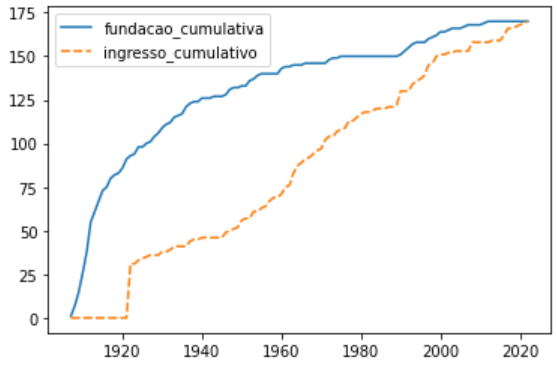
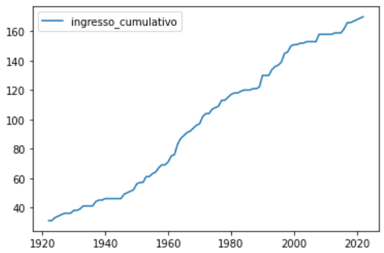

# Visualização da Informação

  

## Escola de Matemática Aplicada - Fundação Getúlio vargas

## Mestrado em Modelagem Matemática

  

**Aluno:** Bruno Pereira Fornaro.

**Github do projeto:** https://github.com/BrunoFornaro/datacomic_escotismo

  

# Data Comic - Escotismo

# Exploração dos dados

  

Assim como foi dito no briefing deste trabalho, desejamos trabalhar com dados do escotismo na seguinte forma:

  

* Inclusão e representatividade: em 2020, 38% dos membros da União dos Escoteiros do Brasil eram mulheres;

* Impacto social: em 2006, os escoteiros, na cidade de São Paulo, plantaram 13 mil árvores em 11 minutos (quebrando um recorde mundial);

* Dimensão do movimento escoteiro: começou na Inglaterra, mas se espalhou pelo mundo ao longo dos anos e hoje está presente em 170 países (os dados do ano de chegada do Movimento Escoteiro podem ser encontrados, de forma que é possível ver o crescimento dessa quantidade acumulada de países com escoteiros), e

* Marcos importantes:

  * O Movimento Escoteiro foi fundado em 1907;

  * A chegada no Brasil aconteceu em 1910;

  * A primeira mulher no Movimento Escoteiro ingressou em 1916, e

  * O movimento completa 100 anos em 2007.

  

Alguns dos tópicos acima nos indicam algumas soluções mais diretas:

* Para a proporção de membros mulheres, podemos fazer um gráfico que representa a proporção de homens e mulheres de forma análoga a um gráfico de pizza. A ideia é mostrar essa proporção com um desenho de um lenço, colorido com a cor azul para representar os homens e com a cor rosa para representar as mulheres (pois essa coloração pode ser facilmente interpretada e reconhecida dispensando a necessidade de uma legenda). Assim, conseguimos utilizar um elemento do escotismo para representar esse dado. Também podemos ressaltar que o lenço escoteiro é utilizado de forma que ele distingue diferentes grupos escoteiros e diferentes contingentes, por características como a coloração, desenhos e outros ornamentos, de maneira que também é razoável utilizarmos esse elemento para distinguirmos os gêneros.

* Os marcos importantes podemos representar um a um numa linha do tempo. Como temos um salto grande de tempo no meio do intervalo dos dados (entre 1916 e 2007), precisamos utilizar algum recurso para lidar com a proporção da representação da linha do tempo. Para isso, é proposto inserir no meio da linha do tempo um flor-de-lis, na qual é um símbolo importante para o escotismo, estando presente inclusive no símbolo do Bureau Mundial do Escotismo.

  

Entretanto, temos alguns dados nos quais as soluções são menos diretas para representar. Nesse sentido, com que diz respeito aos dados das árvores plantadas, destacando o impacto social do escotismo, a solução encontrada para mostrar a dimensão da quantidade de árvores que foi plantada foi comparar o comprimento da cidade de São Paulo de leste a oeste com o comprimento que podemos obter se dispormos todas essas árvores deitadas em uma linha reta (utilizando como base o tamanho médio das árvores no Brasil).

  

Por fim, temos os dados da evolução do número de países que têm escoteiros. Esse é o que devemos explorar mais, pois a ideia dele já foi concebida antes mesmo de obter e explorar o dado: plotar um gráfico de linha que mostra o crescimento de número de países com escoteiros, e desenhar no quadro o gráfico com um escoteiro escalando ele, como se fosse uma montanha.

  

Dessa forma, utilizamos o `Excel` para realizar uma primeira limpeza na base de dados, para tirar alguns caracteres especiais e anotações que estavam no meio dos dados (pois eram poucos dados, essa foi uma abordagem mais prática) , após isso utilizamos o `Python` e a biblioteca `Pandas` para receber os dados e realizar poucas transformações, pois queremos fazer uma contagem dos países que ingressaram no escotismo em cada ano, e depois uma contagem acumulada. Como essas partes são relativamente simples computacionamente,  entretanto ocupam muito espaço para serem exibidas, vamos omitir nesse relatório mas é possível ver no notebook no [repositório no GitHub](https://github.com/BrunoFornaro/datacomic_escotismo) todo o passo a passo. Com os dados tratados, utilizamos `seaborn` para realizar a exploração de dados, com as visualizações. Ao longo desta disciplina, de Visualização de Informação, foi utilizado muito a biblioteca `altair` para realizar os projetos intermediários, por alguns interesses específicos, como mostrar os resultados em `html` e ter liberdade para editar os resultados dos gráficos e obter uma visualização realmente competente e apresentável. Entretanto, o `altair` requer mais esforço para fazer gráficos simples, e dificultaria o processo de exploração (consideramos ele melhor para resultados finais, não para explorações inicias - embora em alguns caso, para desenvolver gráfico mais complexos ou que vão além do que o `seaborn` consegue produzir, o `altair` pode ser muito bom).

  

Dito isto, temos abaixo o primeiro gráfico de linhas feito, onde analisamos o ano que algum orgão reconhecido do escotismo surgiu no país e o ano que órgão nacional se filiou ao o órgão mundial ([WOSM](https://www.scout.org/) - World Organization of the Scout Movement), separadamente:

  

  

Com isso, vemos que para a ideia inicial um dos gráficos de linha é claramente mais compatível com o desenho, de desenhar um personagem escalando. Dessa maneira, por uma escolha mais editorial, vamos trabalhar com esse gráfico. Apenas precisamos filtrar um pouco mais os dados, para retirar o primeiro "degrau" nos dados, onde vemos que de um ponto para outro temos um acréscimo de 31 países (por conta do ingresso no órgão mundial). Assim, obtemos abaixo o resultado que desejamos:

  

  

Dessa forma, conseguimos obter todos os gráficos que desejamos, na idealização e também já com o dado explorado e compatível com a ideia visual.

  

# Bibliografia

  

BASSO, Beta; VILHENA, Altamiro. Balaio Quadrado. https://www.instagram.com/balaioquadrado/. Acesso em 5 de dezembro de 2022.

  

BADEN-POWELL, Robert Stephenson Smyth. Escotismo para rapazes. Disponível em: https://www.escoteiros.org.br/literaturas/Gerais/Escotismo_para_rapazes.pdf. Acesso em 5 de dezembro de 2022.

  

WIKIPEDIA. List of World Organization of the Scout Movement members. Disponível em: https://en.wikipedia.org/wiki/List_of_World_Organization_of_the_Scout_Movement_members#cite_note-FactsheetABSA-4. Acesso em 5 de dezembro de 2022.

  

HERITAGE. SCOUTING ON THE HOME FRONT 1914-1918. Disponível em: https://heritage.scouts.org.uk/exhibitions/scouting-in-the-first-world-war/scouting-on-the-home-front-1914-1918/. Acesso em 5 de dezembro de 2022.

  

LYNCH, Angela. 23 MAR SCOUTS IN THE SECOND WORLD WAR. Disponível em: https://www.dday.org/2017/03/23/scouts-in-the-second-world-war/. Acesso em 5 de dezembro de 2022.

  

LULABORGES. LULA BORGES. Disponível em: http://lulaborges.blogspot.com/2009/07/fonte-lula-borges-versao-25.html. Acesso em 5 de dezembro de 2022.

  

ESCOTEIROS. Escotismo é coisa de mulher, sim. Disponível em: https://www.escoteiros.org.br/noticias/escotismo-e-coisa-de-mulher-sim/. Acesso em 5 de dezembro de 2022.

  

FOLHA. Escoteiros plantam 13 mil árvores em 11 minutos na cidade. Disponível em: https://www1.folha.uol.com.br/folha/dimenstein/cbn/m_sp_040406.htm. Acesso em 5 de dezembro de 2022.

  

ESCOTEIROS. Igualdade de gênero no Movimento Escoteiro. Disponível em: https://www.escoteirosrs.org.br/post/a-import%C3%A2ncia-da-igualdade-de-g%C3%AAnero-no-movimento-escoteiro. Acesso em 5 de dezembro de 2022.

